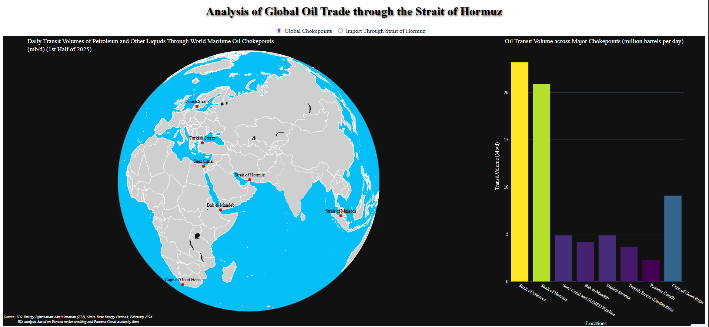
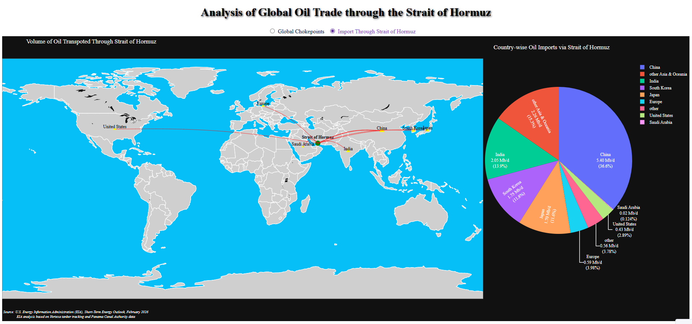

# 🌍 Geospatial Analysis of Global Oil Trade via the Strait of Hormuz

This project presents an interactive geospatial dashboard for analyzing global oil transportation networks, with a specific focus on the Strait of Hormuz — the world’s most critical maritime chokepoint. The dashboard integrates spatial mapping, flow visualization, and statistical analysis to understand oil transit patterns and geopolitical dependencies.

---
## 📖 Research Context

The Strait of Hormuz is one of the most critical maritime chokepoints in global energy trade, handling a significant share of the world's oil transport.

This dashboard aims to:
- Analyze global oil flow distribution
- Identify critical chokepoints
- Assess country-level dependency
- Support geopolitical and risk analysis

This work aligns with research in:
- Energy security
- Maritime trade networks
- Geospatial analytics

## ⚙️ Workflow

1. Data Collection (EIA, Vortexa, Canal Authorities)
2. Data Cleaning & Processing (Pandas, GeoPandas)
3. Geospatial Mapping (Matplotlib / Plotly)
4. Dashboard Development (Dash)
5. Visualization & Analysis

## 🔍 Key Features

- 🌐 Visualization of major global oil chokepoints  
- 📍 Spatial mapping using shapefiles  
- 🔁 Flow map of oil imports from the Strait of Hormuz  
- 📊 Interactive charts (bar + pie)  
- 🎯 Hover-based insights with formatted values  
- 🧭 Clean and responsive dashboard UI  

---

## 🛠️ Geospatial Tools & Libraries
- Python  
- Dash  
- Plotly  
- GeoPandas  
- Pandas  

---

## 📊 Data Sources

- U.S. Energy Information Administration (EIA)  
- Vortexa tanker tracking  
- Panama Canal Authority  

## 📸 Dashboard Preview

### 🌍 Chokepoints Map

### 🔁 Import Flow Map

## 🌐 Live Dashboard

Access the deployed interactive dashboard here:

